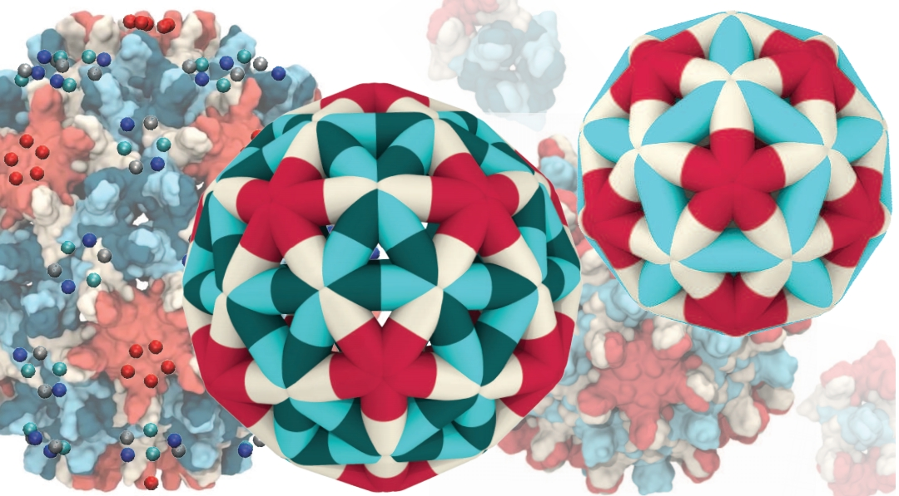

# GCMC HEVA
**G**rand **C**anonical **M**onte **C**arlo Simulations using **H**alf **E**dge data-structure for **V**irus **A**ssembly



## Overview
This repository contains the implementation of a Grand Canonical Monte Carlo (GCMC) simulation framework for studying virus capsid assembly, specifically focusing on the Hepatitis B Virus (HBV). The codebase utilizes a half-edge data structure for efficient geometric computations and assembly simulations.

## Model Description
The simulation framework implements a multiscale model of HBV capsid assembly that:
- Represents capsid proteins and their interactions at a coarse-grained level
- Incorporates thermodynamic and kinetic aspects of assembly
- Accounts for the dimorphic nature of HBV capsids (T=3 and T=4)
- Uses GCMC to sample different assembly states and configurations

### Key Features
- **Half-edge Data Structure**: Efficient representation of dimer subunits using a doubly connected edge list (DCEL)
- **Two Edge Types**: 
  - AB edge (AB and BA half-edges) representing AB dimer conformation
  - CD edge (CD and DC half-edges) representing CD/CC dimer conformation
- **Conformation-Dependent Interactions**: Different binding affinities for various dimer-dimer interactions
- **Elastic Energy Model**: Incorporates stretching, bending, and binding angle moduli


## Key Findings
Our model captures key biophysical characteristics of HBV capsid assembly and offers insights into its polymorphic behavior. Specifically, we observe:

1. **Assembly Pathways**: The simulation framework reproduces experimentally observed assembly trajectories, including the formation of both T=3 and T=4 icosahedral capsids.

2. **Polymorphism Control**: The model highlights how capsid polymorphism emerges from a combination of factors:

- The underlying conformational energy landscape 
- Variations in dimer-dimer binding affinities
- Coupling between protein conformation and interaction specificity

3. **Ionic Strength Effects**: Simulations reveal that higher ionic strengths favor the assembly of T=3 structures, suggesting a shift in conformational equilibrium toward CD dimer formation under these conditions.

For a more detailed discussion of the model and results, see our publication:
[Multiscale Modeling of Hepatitis B Virus Capsid Assembly and Its Dimorphism](https://pubs.acs.org/doi/10.1021/acsnano.2c02119)

## Implementation Details
### Dependencies
- GSL (GNU Scientific Library)
- C++ compiler with C++11 support
- Make build system

### Building the Project
1. Install dependencies:

   ```bash
   # Windows (MSYS2)
   pacman -Syu
   pacman -S mingw-w64-x86_64-gsl mingw-w64-x86_64-gcc make

   # Linux (Ubuntu/Debian)
   sudo apt-get update
   sudo apt-get install libgsl-dev g++ make

   # Linux (Fedora)
   sudo dnf install gsl-devel gcc-c++ make

   # Linux (Arch)
   sudo pacman -S gsl gcc make

   # macOS (Homebrew)
   brew update
   brew install gsl gcc make
   ```

2. Build the project:
   ```bash
   cd src
   make clean
   make assembly
   ```

### Code Structure
- `src/geometry.cpp/hpp`: Geometric computations and half-edge data structure
- `src/montecarlo.cpp/hpp`: Monte Carlo simulation implementation
- `src/tri_tri_intersect.cpp/hpp`: Triangle intersection detection
- `src/run_assembly.cpp`: Main simulation driver

### Monte Carlo Moves
The simulation includes several MC moves:
1. Vertex displacement
2. Single edge addition/removal
3. Paired edge addition/removal
4. Simple boundary binding/unbinding
5. Wedge fusion/fission
6. Conformational switch


## Contributing
Contributions are welcome! Please feel free to submit a Pull Request.

## License
This project is licensed under the MIT License - see the [LICENSE](LICENSE) file for details.

## Citation
If you use this code in your research, please cite:
Farzaneh Mohajerani, Botond Tyukodi, Christopher J. Schlicksup, Jodi A. Hadden-Perilla, Adam Zlotnick, and Michael F. Hagan. "Multiscale Modeling of Hepatitis B Virus Capsid Assembly and Its Dimorphism." ACS Nano 16, no. 9 (2022): 13845–13859. https://doi.org/10.1021/acsnano.2c02119.
