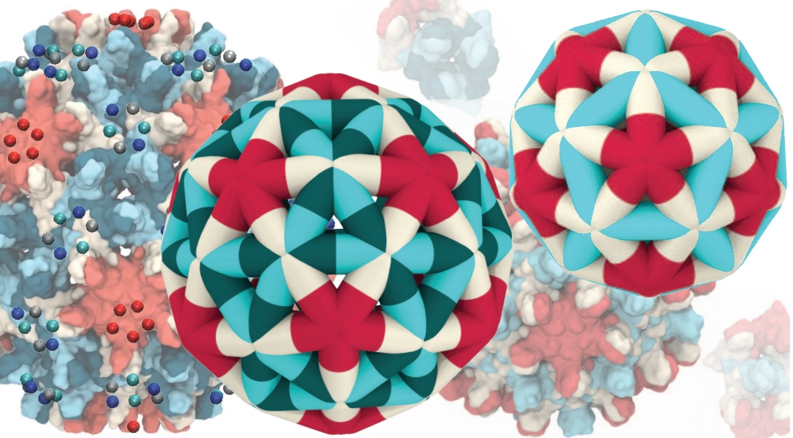

# GCMC HEVA
**G**rand **C**anonical **M**onte **C**arlo Simulations using **H**alf **E**dge data structure for **V**irus **A**ssembly

## Overview
This repository contains the implementation of a Grand Canonical Monte Carlo (GCMC) simulation framework for studying virus capsid assembly, specifically focusing on the Hepatitis B Virus (HBV). It combines:

- a coarse-grained capsid assembly model
- a half-edge data structure for geometry and topology
- Monte Carlo moves for growth, removal, fusion, and conformation changes
- explicit run directories with reproducibility artifacts

For the scientific background, see:
[Multiscale Modeling of Hepatitis B Virus Capsid Assembly and Its Dimorphism](https://pubs.acs.org/doi/10.1021/acsnano.2c02119)

## Model Description
The simulation framework implements a multiscale model of HBV capsid assembly that:

- represents capsid proteins and their interactions at a coarse-grained level
- incorporates thermodynamic and kinetic aspects of assembly
- accounts for the dimorphic nature of HBV capsids, including T=3 and T=4 outcomes
- uses Grand Canonical Monte Carlo to sample different assembly states and configurations

### Key Features
- **Half-edge data structure**
  Efficient representation of dimer subunits using a doubly connected edge list

- **Conformation-dependent interactions**
  Different dimer-dimer interfaces can carry different binding affinities

- **Elastic energy model**
  Stretching, bending, and binding-angle penalties are included in the Hamiltonian

- **HBV polymorphism**
  The model is designed to capture competition between T=3 and T=4 assembly outcomes

## Key Findings
The model is designed to probe how assembly outcomes depend on:

- conformational energetics
- dimer-dimer binding specificity
- geometry and elastic frustration
- kinetic accessibility of competing growth pathways

In the associated study, the model reproduces experimentally observed assembly behavior, including competition between T=3 and T=4 capsids and shifts in assembly outcome under changing conditions such as ionic strength.

## Project Documentation
For build, run, configuration, output-file, and architecture details, see `docs/`:

- [docs/running-heva.md](docs/running-heva.md)
- [docs/config-format.md](docs/config-format.md)
- [docs/output-files.md](docs/output-files.md)
- [docs/architecture.md](docs/architecture.md)

## License
This project is licensed under the MIT License. See `LICENSE`.

## Citation
If you use this code in your research, please cite:

Farzaneh Mohajerani, Botond Tyukodi, Christopher J. Schlicksup, Jodi A. Hadden-Perilla, Adam Zlotnick, and Michael F. Hagan. "Multiscale Modeling of Hepatitis B Virus Capsid Assembly and Its Dimorphism." ACS Nano 16, no. 9 (2022): 13845-13859. https://doi.org/10.1021/acsnano.2c02119.
